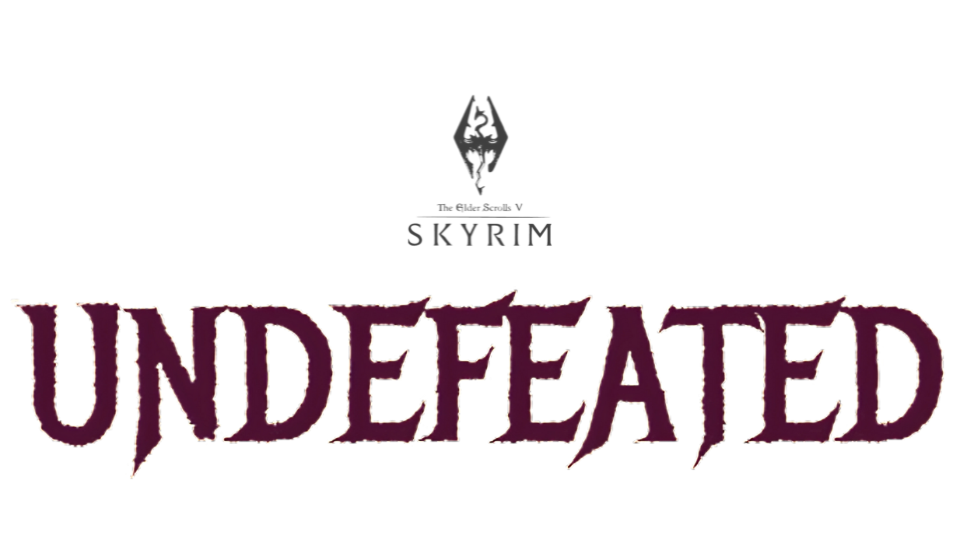

This isn’t just a collection of mods thrown together—it’s what I always felt Skyrim was missing. While building it, I kept thinking, "Why hasn’t anyone done this yet?" Not because it’s groundbreaking, but because it fills the gaps left by other lists. No trade-offs, no shortcuts—just more depth, more detail, and immersion pushed as far as Skyrim’s engine can handle.

It’s designed to feel both nostalgic and new. It's like starting Skyrim for the first time, but everything clicks differently. The landscapes look sharper, the world feels fuller, and every quest has more weight. You’ll recognize the foundation, but the experience pulls you in deeper.

You’ll need to eat, drink, and stay warm—not as a survival chore, but because it grounds you in the world. The gameplay isn’t about meters or mechanics; it’s about immersion. You’ll find yourself lost in stories, wandering into unexpected encounters, and realizing hours have passed without noticing.

Combat feels crisp, magic packs a punch, and the AI won’t let you breeze through. Enemies are smarter, fights are more dynamic, and your decisions carry weight. Companions aren’t just there for company—they react, evolve, and remember how you treat them. Your reputation isn’t just cosmetic; it shapes the world around you.

Visually, it’s stunning. Photorealistic graphics, layered environments, and hundreds of hours of quests that pull from different genres—Mortal Kombat, Street Fighter, Super Smash Bros, Injustice, Naruto, Marvel, Kingdom Hearts. It’s all woven in, sometimes subtle, sometimes front and center, blending into the world in its own unique way.

You won’t start with overpowered gear. Just the basics, like any fresh adventurer. The rest? Earned through exploration, battles, and choices. It’s still Skyrim—search, conquer, and let the world unfold around you.

At its core, this is about leveling up beyond the standard Dovahkiin. Whether you’re a samurai mage, a stealth archer, or someone who just wants to punch dragons in the face, the tools are here. The world reacts to you, companions grow with you, and no two journeys will feel the same.

There’s no hand-holding. Just dive in, get lost, and let the story write itself.

  <a href="https://docs.google.com/document/d/18zwPnSO76vas-NXhfJUNbNowZoC-Be762XtdjPO-gGo/edit?usp=sharing">ENTER</a>
  

